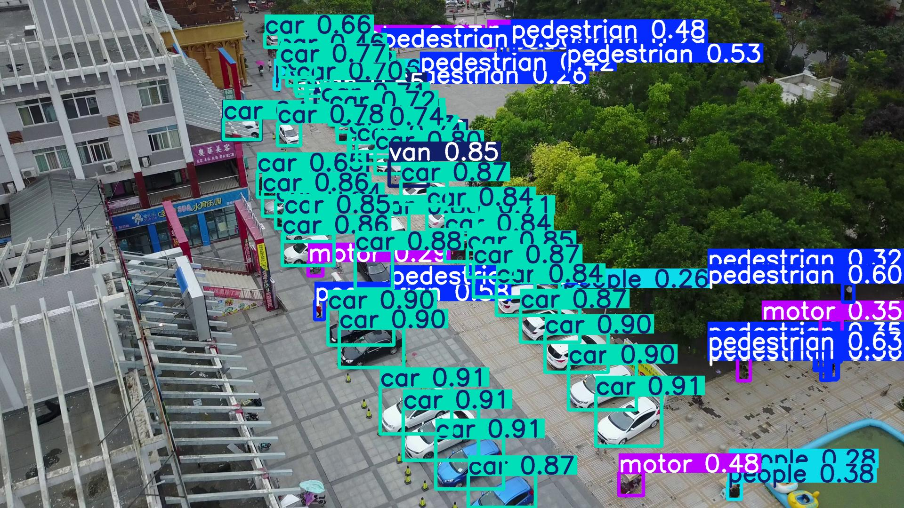
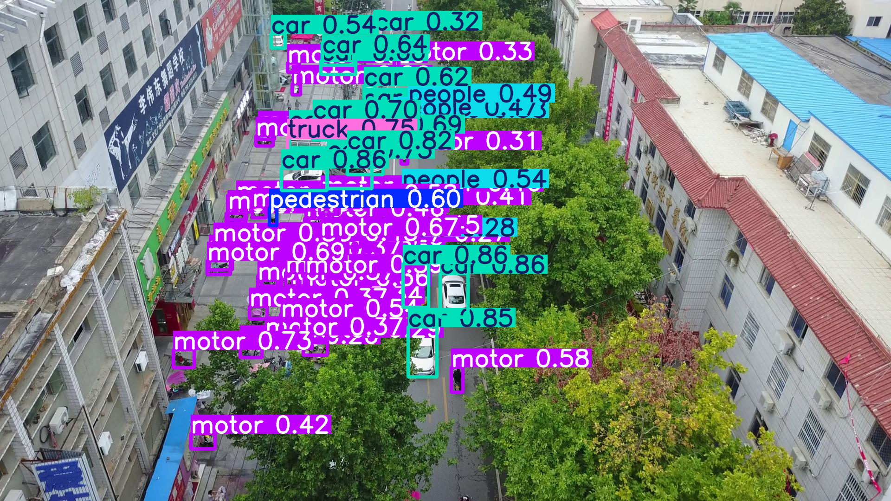

# Object detection with Yolo11 on VisDrone dataset

## 🔎 Overview and Results
We trained Yolo11x model for  [KAU Object Detection: VisDrone 2025](https://www.kaggle.com/competitions/kau-object-detection-vis-drone-2025) competition

⭐We got **0.17255** private and **0.17867** public score for the last our model

⭐ We got  **mAP50=0.461**  and  **mAP50-95 = 0.267** on validation dataset

Submission file: [submission-yolo11x-100.csv](./submission-yolo11x-100.csv)
### Example 
 * 
 * 

## 🔗 Links to notebooks, datasets, competition
 * [Competition](https://www.kaggle.com/competitions/kau-object-detection-vis-drone-2025)  - contains original dataset in PascalVOC-like format 
 * [Setup notebook](https://www.kaggle.com/code/volodymyrhryniuk/kau-visdrone-2025-pascal-voc-to-yolo-format) - its [setup-VOC-to-YOLO.ipynb](./setup-VOC-to-YOLO.ipynb) notebook, for conversion dataset to coco format
 * [Copy of Competition dataset](https://www.kaggle.com/datasets/volodymyrhryniuk/visdrone-kau-copy/)
 * [Converted YOLO dataset](https://www.kaggle.com/datasets/volodymyrhryniuk/visdrone-kau-2025-dataset-yolo-format)
 * [Training Kaggle notebook](https://www.kaggle.com/code/volodymyrhryniuk/kau-visdrone-2025-yolov11x-training) - its [this](./kau-visdrone-2025-yolov11x-training.ipynb) notebook

## 🏋🏻‍♂️ Training
We fine-tuned Yolo11x model for 100 epohs, with the next parameters:
* *batch size* - **24**
* *optimizer* - **Adam**
* *learning rate* - **0.001**
* *image size* - **640**

For training, we used **2x Tesla T4** GPU on Kaggle

Additionally, we tried various combinations of training, such as folowing, but they got bad results:
 - 80 epochs of lr=0.01 and 40 epochs of lr0=0.001 & lrf=0.0001
 - 80 epochs of lr=0.01 and 80 epochs of lr0=0.001 & lrf=0.0001
 - 100 epochs of lr=0.001 and 10 epochs of lr0=0.0005 & lrf=0.00001
 - 80 epochs of lr=0.01 and up to 120 epochs of lr<0.01 (check out other Kaggle notebook's versions run's logs)

## ▶️ Install & run 
Training was performed in [Kaggle notebook](https://www.kaggle.com/code/volodymyrhryniuk/kau-visdrone-2025-yolov11x-training/) with **2x Tesla T4** GPU

All notebooks are intended to run in Kaggle environment, so if you want to launch them elsewere, please, change all paths to appropriate, and install all needed CUDA libraries
